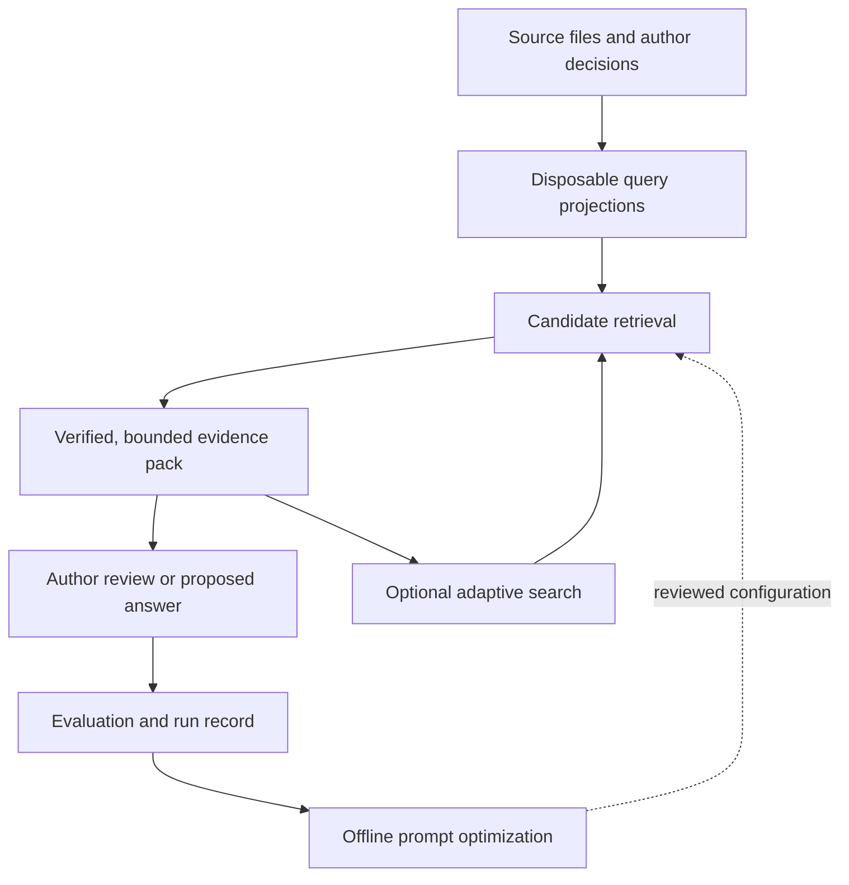

# Architecture starter: hypotheses, RLM, DSPy and the experiments worth doing

2026-10-01. Companion to `strategic-learning_2026-10-01.md` and the operative
`Plan/briefings/architecture-session.md`. The author clarified that this PR
should expand the reasoning, ideas, plan and caveats so Claude can continue.
It does not implement or adopt a final architecture. Every design below is a
hypothesis; the measurements it cites remain in their original run folders.

The author's additional pointer to [PR #140](https://github.com/netzkontrast/kohaerenzprotokoll/pull/140)
is incorporated in `pr140-architecture-input_2026-10-01.md`. Read that inspection
before proposing another RLM controller or run. It distinguishes the branch's
implemented tools, its incomplete checked-in results and the evaluation limits.

## 1. Start with the work the author needs to do

There are several different tasks hidden inside “understand the project”. They
need different reading policies and different evaluation targets.

| Task | Useful output | Main failure | Appropriate starting method |
|---|---|---|---|
| Locate a known claim | Exact source and line, with surrounding qualifications | Plausible answer with the wrong referent | Deterministic search and line verification |
| Explain disagreement | Attributed positions and the exact unresolved question | Majority or recency silently becomes authority | Graph-assisted evidence pack, then explicit judgement |
| Discover relevant material | Candidate sources and why they might help | Search misses English/German variants or evidence outside the wiki | Lexical baseline, optional semantic search, bounded query expansion |
| Ingest a document | Independent candidate list and a faithful reading of the whole source | Prior wiki expectations decide what the reader notices | Full source-local reading, frozen before reconciliation |
| Prepare a chapter decision | Relevant choices, constraints and consequences | Research recommendations become canon or reveal later knowledge | Approved decisions plus chapter-scoped evidence; unanswered choices remain visible |
| Inspect engineering history | Reproducible results, failed claims and next experiments | Repeated narrative summaries masquerade as independent evidence | Run ledgers and deterministic diagnostics, with selective explanation |

The first product slice should be a question-to-evidence workflow that is useful
without an autonomous agent. The author should be able to inspect the pack and
its disagreements before any generated answer. Answer generation, adaptive
search and optimization can then be evaluated as separate additions.

## 2. A working architectural hypothesis

Retain the existing files and the shared graph/FTS projection. Concentrate the
next work on a common evidence boundary rather than a new framework or graph.
These are responsibilities, not a proposal for additional authoritative layers.

The optimization arrow deploys a reviewed configuration. It does not send the
model's conclusions back into source facts or author decisions. A generated
`M-ask` answer can remain a logged model reading under decision 017 while being
excluded from independent evidence and gold for its own generator.

### The boundary that would make the pieces composable

An illustrative result contract, to check against real instances before coding:

| Contract | Information needed | Owner / consequence |
|---|---|---|
| Source location | Existing source slug, source revision/hash, file line range | The source resolver owns numbering; the model never calculates citations |
| Retrieval candidate | Source location, finder, rank, candidate kind | Scores from different finders are not assumed comparable; rank fusion needs evaluation |
| Verified evidence | Source location, exact slice, resolution verdict | Verification establishes text identity, not the interpretation's truth |
| Evidence pack | Question/scope, source snapshot, included and omitted evidence, disagreements, budget unit | One packing implementation; serialized metadata and instructions also consume budget |
| Run outcome | Submitted/refused/incomplete/unparsed/unreachable, checks, usage and limitations | Unknown outcomes cannot become successful measurements |

No new stable ID or field is mandated by this table. Reuse the current
`ask.py` metadata, `kg.py` context output and novelgraph hits where possible.
If a field is not consumed, it has not earned a schema. Freeze one input
snapshot throughout retrieval, packing and verification; refuse or restart if
the source changes halfway through rather than mix revisions.

### Why this might outperform a larger redesign

The repository already has source identity, line verification, reconciliation,
graph projection, FTS and an incremental chunk index. The principal unknown is
which combination helps the author per unit of context and effort. A common
evidence contract makes that comparison possible while preserving the tools.
It also lets a CLI and a future UI consume the same result without running an
MCP server or requiring a database service.

The counterargument is that adapters can preserve accidental complexity.
Claude should trace an actual query and update path, name duplicate ownership,
and consolidate where parity can be demonstrated. “Keep everything” is not a
solution; neither is deleting a tool merely because another tool has its name.

## 3. RLM: promising for adaptive investigation, risky as a reading shortcut

The RLM paper [Recursive Language Models, v3](https://arxiv.org/abs/2512.24601v3)
describes keeping a long input in an external environment, with programmatic
inspection and recursive model calls over selected parts. Its benchmark results
are evidence for that paradigm on its tasks, not measured gains for this repo.

The useful transfer here could be an **evidence workspace**: a task keeps source
pointers, verified slices and intermediate questions outside the root prompt.
The root sees bounded results and asks for additional evidence only where it
can name a remaining uncertainty. Start with fixed read-only operations such as
search, source-window lookup, stated graph neighbours and count/timeline queries.
These are proposed operations, not new CLI flags or existing APIs.

### Three approaches to compare

| Approach | What it gains | What it pays | When it earns use |
|---|---|---|---|
| Current retrieval and one pack | Predictable provenance and cost | A fixed routing decision can miss a needed source | Default for simple lookup and the experimental baseline |
| Bounded query expansion | A second search can resolve a named gap | Extra routing and repeated context | Complex questions where a second pass demonstrably helps |
| `dspy.RLM` over an external workspace | Programmatic inspection and selective subcalls | REPL runtime, planning calls, growing history and fallback behavior | Tasks needing decomposition beyond a simpler controller, on equal-budget comparisons |

Bounded query expansion is RLM-inspired, but is not automatically a recursive
language model. Calling a root agent plus children “RLM” does not establish the
external-context mechanism or its benefit. Test the simplest controller first.

### What this repository's experiments actually say

Main and open branches must be distinguished. PR #140 implements graph retrieval
and `novelgraph rlm` over indexed chunks, with Claude-only calls through `lmrun`
and an ongoing chunk-size study. Reuse that work rather than start another RLM
project. At the inspected head, 13/72 main result rows are checked in; there is no
completed size decision or comparison against a non-RLM controller. Its score
measures selected chunk coverage, not necessarily read evidence; see the linked
inspection for budget, missing-outcome, threshold and resume caveats.

`scripts/rlm_ingest.py` already wraps `dspy.RLM` for a single document; it is not
a corpus-query controller. Its implementation and the repo's
`.agents/skills/dspy/references/rlm.md` must be inspected before extending it.

- `rlm-measured-on-the-trap_2026-09-17.md` records an RLM missing Sophia in a
  document that says four Guardian/world pairs but names five Guardians. The
  low iteration limit and differing models prevent an algorithm ranking.
  The concrete defect is trusting a framing count instead of connecting the
  qualifications and structure elsewhere in the document.
- `rlm-the-real-one_2026-09-17.md` and `rlm-transfer_2026-09-17.md` argue for
  corpus navigation while retaining independent document reading. They are
  dated concepts; their batch counts and earlier dependency recommendations
  must not become current instructions.
- `rlm_ingest.py` verifies term occurrence and citation reach. Reaching near
  the end and citing scattered lines does not prove complete reading or
  semantic fidelity. Its “a reading” verdict is narrower than its name suggests.
- The ingestion runner requires an approval string but constructs `dspy.LM`
  directly against OpenRouter. It does not use `lmrun.call`'s per-call JSONL
  wrapper. Before any new real run, reconcile backend/consent validation and
  comprehensive call accounting; a non-empty approval string alone is not
  proof that the actual transmission falls within an author's decision.

### Caveats Claude must design around

The repo is pinned to DSPy 3.3.1. Its reference documents that `max_llm_calls`
limits subcalls, not outer action calls, forced extraction or adapter retries.
The [official RLM API](https://dspy.ai/current/api/modules/RLM/) also distinguishes
iteration, subcall and output limits. Check the pinned implementation: current
web documentation can describe a different release.

An iteration cap is therefore not a total usage cap. Any pilot needs a shared
budget checked before each root, child, reflection and retry call. Sequential
subcalls are required by the standing usage instruction; a built-in batched
primitive must not silently introduce concurrent model calls.

Forced output is an incomplete investigation even if its shape parses. The
existing runner detects forced finalization; keep that distinction. If the
budget expires, return the supported evidence and the unresolved question.
Do not manufacture closure from scrollback. Additional stop reasons include
repeated subqueries, no new distinct verified evidence and an author-only choice.

Host-side tools are part of the security and permission boundary. A sandbox
does not make a custom I/O tool harmless. Restrict the experiment to read-only
source operations; do not expose raw shell, arbitrary paths, writes or provider
credentials. Treat directives inside research documents as quoted content.

Finally, repeated history, child prompts and sandbox startup can erase an
apparent token saving. Report cumulative usage, cold/warm latency, truncation
and all omitted information. The idea saves context only if the complete
trajectory is cheaper at comparable usefulness.

## 4. DSPy: optimize a demonstrated failure, not the whole project

DSPy supplies a program/module surface; it is not by itself an improvement
loop. The loop needs examples, a metric that can fall and an explicit deployment
decision. [GEPA](https://arxiv.org/abs/2507.19457) uses textual feedback from
execution to propose improved instructions. That suggests turning this repo's
specific verification failures into feedback instead of generic “be accurate”.

### Candidate surfaces, in recommended order

| Surface | Why it could help | Baseline | Feedback / veto | Main caveat |
|---|---|---|---|---|
| Query-to-surface routing | English questions can miss German concepts | Current fold/gloss routing, then a hand-written rewrite | Evidence reached at fixed pack budget; unsupported merges veto adoption | The allowed surface list can prevent discovery of concepts the wiki has never named |
| Answer rule card in `ask.py` | Reduce misattribution and misleading absence claims | Same pack and backend, existing `RULES` | Placement defects plus independently reviewed semantic fidelity | Perfect quotation placement can still support a wrong conclusion |
| Reader instruction/card | Target subject, voice and qualification errors from the lab | Current clean reader on the same permitted document | Defect-class audit, completeness and total usage | Optimizing selective snippets is not evaluating full document ingestion |
| Tool/skill selection description | Reduce irrelevant instructions and unnecessary context | Current description and captured routing failures | Correct workflow/tool choice; valid skill metadata | No real failure corpus yet; fabricated volume would create a benchmark detached from use |
| Relation-contract instructions | Improve endpoints/types without broad backfill | Existing contracts and blind relation gold | Per-contract agreement and downstream marginal utility | One reader's omissions are not false positives; relation precision is not term-list precision |
| Adaptive search policy | Choose whether another query is worth its cost | Fixed expansion rules | Useful new evidence per total call budget | This is the last candidate: the environment and scorer must be stable first |

`Plan/concept/dspy-learning_2026-09-30.md` already proposes the first surfaces.
Reuse that work and its failure evidence. Do not install a second DSPy project
or silently copy an optimizer from a newer documentation version.

Use a ladder: deterministic baseline → manually revised instruction → labeled
examples → bounded optimization only if the remaining failures justify it.
Which optimizer fits depends on the artifact: `dspy.GEPA` for a DSPy program,
`gepa.optimize_anything` for an instruction or other text artifact. The
[GEPA guide](https://gepa-ai.github.io/gepa/guides/quickstart/) distinguishes those
routes. The repo's pinned GEPA API and surface probes govern runnable code.

Freeze train/development/test boundaries by source/task families. A development
winner is a candidate, not the final test result. Hold the backend and pack
constant while optimizing answer instructions; hold the answering instructions
constant while testing routing. Otherwise a score cannot explain which change
helped. Log every configuration tried, not just the survivor.

Do not optimize truth or author intent with a single averaged reward. Keep hard
vetoes for fabricated citations, unsafe merges and dropped disagreement beside
task quality, cost and unavailable/unscorable states. Do not treat a provider
failure as semantic failure or allow abstention on everything to earn perfection.
Useful abstention and successful supported answers need separate measurements.

Optimization evaluation calls, reflection calls, adapter retries and rejected
candidates all consume usage. For a future pilot, an illustrative planning
envelope is 30 metric evaluations and a separately enforced 50 total model-call
ceiling, sequentially. This is a proposed cap, not a spend authorization or a
cost estimate; choose a smaller cap when the actual pack size requires it.

## 5. Other ideas worth considering before adding another agent

| Idea | Practical contribution | Limit / test |
|---|---|---|
| Deterministic corpus queries | Count, occurrence mode, chronology and co-occurrence across source metadata/text without filling a prompt | A frequency is not importance, authority or causal evidence; use existing `corpus.py` |
| Evidence diversity in the pack | De-duplicate line ranges and preserve contrasting readings instead of many near-identical hits | Diversity can sacrifice the decisive passage; compare against simple ranking at equal budget |
| Structural context on demand | Expand a hit to a section or a qualification when a short window changes its sense | Retrieval excerpts remain incomplete; a census still requires independent full reading |
| Incremental invalidation | Recompute only affected projections or compiled artifacts when their exact inputs change | Code, tokenizer, embedder, model and prompt changes can matter as much as source hashes |
| Checkpointed investigation | Resume from verified pointers, unresolved questions and consumed budget | A resumed run must retain previous spend and reject a changed snapshot; do not carry model claims as facts |
| Typed decision impact | Show which existing sheets/chapters a proposed author choice touches | Use stated edges and `askdb.py touches`; an inferred dependency is still a proposal |
| Thin CLI with optional UI | One JSON/evidence contract serves terminal work and a later interface | No new user-facing flag without the author's decision; wrapper convenience must not duplicate rules |
| Evidence caching | Reuse immutable projections and exact packs keyed by inputs | Disable stochastic answer replay when measuring reliability; distinguish reuse from fresh attempts |

Spoiler control deserves its own test when writing resumes. “Only sources dated
before chapter N” is not reader-knowledge control. An author-approved model of
what reader/Kael/AEGIS can know at that point is still needed. Until then a
chapter-specific pack cannot claim to be safe for drafting.

## 6. Comparable architecture options

| Option | New mechanism | Expected benefit, unmeasured | Complexity / principal risk | Recommendation now |
|---|---|---|---|---|
| H0: current graph + FTS + one verified pack | Existing implementation | Reliable baseline with explicit provenance | Circular gold can conceal gaps | Keep as baseline and viable default |
| H1: H0 plus optional novelgraph candidates | Adapter and shared pack contract | Reach material lexical routing misses | Weak embedder/domain fit; duplicate chunks and cold load cost | First retrieval candidate to measure, not a default switch |
| H2: H0/H1 plus bounded adaptive expansion | Small read-only task controller | Resolve named gaps with selective extra context | Repeated calls without useful evidence | Candidate after pack/evaluation contracts are stable |
| H3: H2 with `dspy.RLM` workspace | REPL and controlled child calls | More flexible decomposition for complex research questions | Incomplete readings, history cost, sandbox and consent gaps | Experimental comparator, not the ingestion default |
| H4: DSPy compilation alongside H0–H3 | Offline training/evaluation of selected surfaces | Improve recurring failure classes | Overfitting a biased scorer; hidden optimization spend | Add surface by surface after independent evaluation |
| H5: full autonomous extraction/question loop | Corpus-scale generation and recursive research | Potential coverage growth | Unmeasured utility, consent, stalled loops and backfill cost | Do not pursue while pauses and missing utility evidence stand |

H4 is an improvement process, not a replacement retrieval architecture. RLM and
DSPy are compatible but answer different questions: how a task obtains context,
and how a defined program's behavior is improved between runs. Learn one change
at a time before optimizing the combined system.

## 7. Experiment plan for Claude

Experiments below are proposals. “Offline now” means metadata, existing run
artifacts and isolated fixtures only; it does not lift the document-reading pause.
Any new corpus/model run needs its actual authorization checked separately.

| Step | Action / existing anchors | Required output | Continue only if |
|---|---|---|---|
| E0, offline now | Trace `ask.py` route/pack/verify, `askdb.py`, `kg.py`, novelgraph hits and RLM call paths; inspect the latest PR #140 and its existing run before planning more work | Ownership map, actual contracts and reusable artifacts in the architecture-session run README | Main, open-branch behavior and proposals are distinguished; no duplicate run |
| E1, offline now | Freeze the existing regression cases and map their source overlap; inventory independent labels; design masked-document tests with every leakage route named | Versioned case specification, hashes, coverage limits and proposed holdout; do not invent relevance labels | A split's dependence is reported honestly; no discovery claim from current circular gold |
| E2, design now | Specify one common hit/pack contract and H0/H1 comparison at identical serialized budgets | Concrete current examples, failure fixtures and comparison plan; novelty per distinct source/line tracked | An adapter can be evaluated without changing answer instructions or graph truth |
| E3, dry-run first | Script a bounded expansion trajectory with no LM; test repeated queries, missing sources, changed hashes, budget exhaustion and disagreements | Minimal controller proposal and refusal/completion semantics | Existing fixed search does not already answer the task; there is a named gap worth another search |
| E4, gated pilot | Compare fixed pack, bounded expansion and PR #140's reusable RLM tools on identical permitted tasks, snapshot, backend and total budget; this is a controller comparison, separate from its size study | Per-task useful evidence, semantic defects, all usage and stop reasons; both direct and recursive traces | RLM improves the task enough to pay for its additional mechanism |
| E5, gated optimization | Choose only one DSPy surface from the demonstrated failures, with frozen examples and deterministic/unoptimized baselines | Baseline, compiled candidate, held-out comparison and rollback artifact | Hard vetoes hold and improvement replicates outside selection data |
| E6, author-calibrated | Assess evidence packs/answers for actual decision usefulness; later chapter-context sufficiency | Author calibration and disagreement/abstention analysis | A product-value claim has evidence beyond the system's own labels |

Before a pilot, write the main metric, smallest useful gain, accepted quality
loss (if any), uncertainty method, all budgets and stop rules. Tiny overlapping
sets do not become robust by giving their scores more decimals. If no independent
labels are available, report regression stability and the remaining uncertainty.

Do not let E4 or E5 hold the architecture hostage. Claude can finish a target
design with H0 as the supported default and optional interfaces for experiments.
It should document exactly which result would justify activating H1, H2 or H3.

## 8. Claude's first concrete contribution

Continue PR #139's head branch, `codex/strategic-learning-architecture-session`,
where the host permits it. If the host requires a different branch, create a
stacked PR based on this head and link the relationship; do not overwrite this
branch or the author's running work. Inspect current PR state before proceeding.
PR #140 is implementation input: preserve its ongoing experiment and account
for its merge state instead of copying or overwriting its branch.

The first contribution is an ownership/contract map and self-evaluation in the
architecture-session run README, followed by a recommended `SPEC.md`. Identify
which earlier claim fails, which existing tool should own each responsibility,
and which hypothesis can be tested next without model calls. Then select one
small migration with offline acceptance and rollback. Full rollout is not the
starting task. Do not restart backfill or corpus reading to make the spec look
complete.

Claude may reject these hypotheses, including RLM, if it gives repository
evidence and a stronger alternative. The purpose of the starter is to expose
tradeoffs and make the next session productive, not to pre-select a fashionable
architecture. `architecture-session.md` owns the final deliverable criteria.

## 9. Sources and version boundaries

Public sources checked on 2026-10-01:

- [Recursive Language Models, v3](https://arxiv.org/abs/2512.24601v3): external
  context and recursive investigation; no automatic transfer of paper gains.
- [DSPy RLM API](https://dspy.ai/current/api/modules/RLM/): conceptual/module
  interface and limitations; runnable behavior is checked against pinned 3.3.1.
- [GEPA paper](https://arxiv.org/abs/2507.19457): reflective optimization from
  execution feedback; not proof that this project's metric is suitable.
- [GEPA guide](https://gepa-ai.github.io/gepa/guides/quickstart/): program versus
  text-artifact optimization; current examples may differ from pinned GEPA.

Repository evidence: the strategic-learning review, `evaluation-audit`,
`dspy-learning`, the reader lab, gold-relations pilot, PR #137 validation,
the RLM trap and transfer notes, the `dspy` skill and actual script call paths.
PR #140's inspected commit and run limitations are recorded in the companion
`pr140-architecture-input_2026-10-01.md`; refresh that snapshot before reuse.
External papers are design inputs, not novel sources or author decisions.
